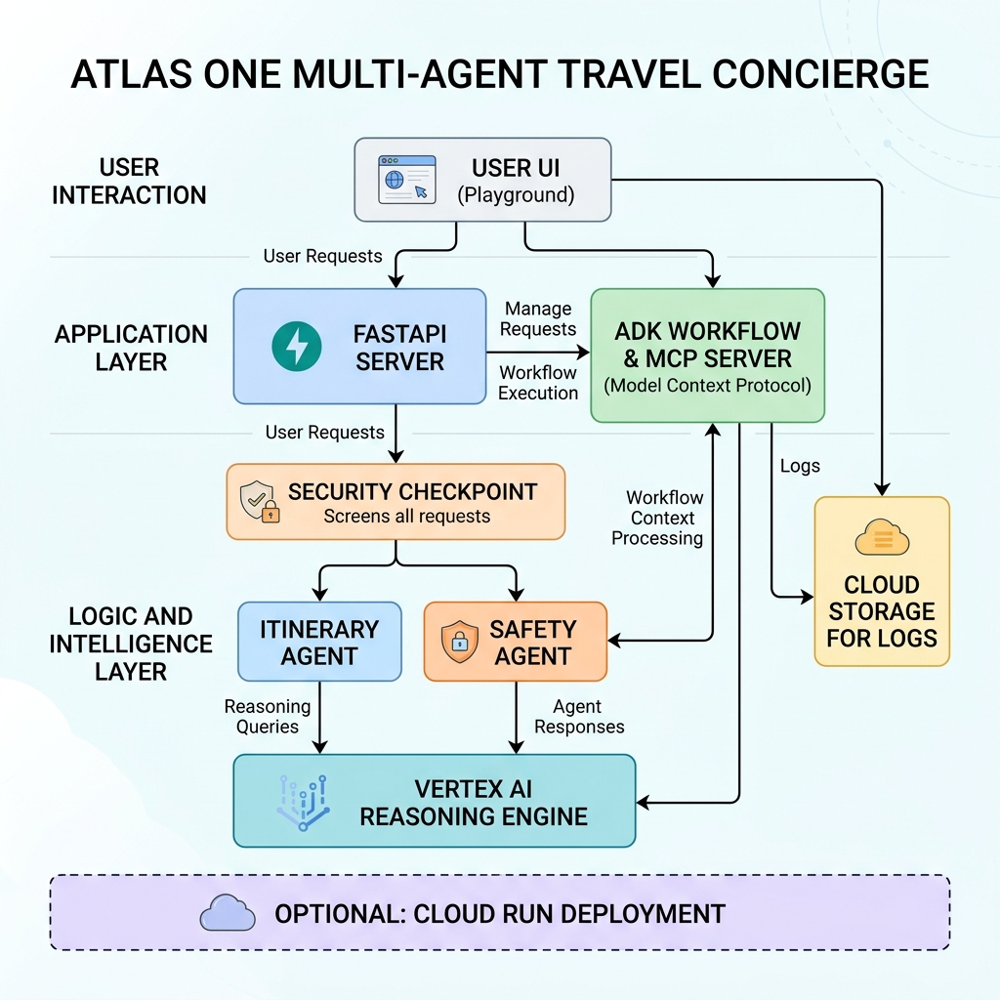
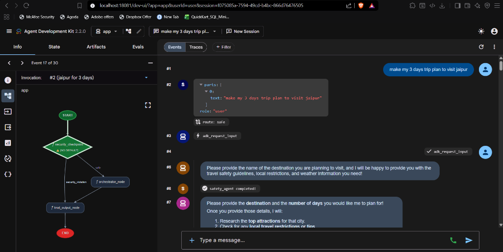
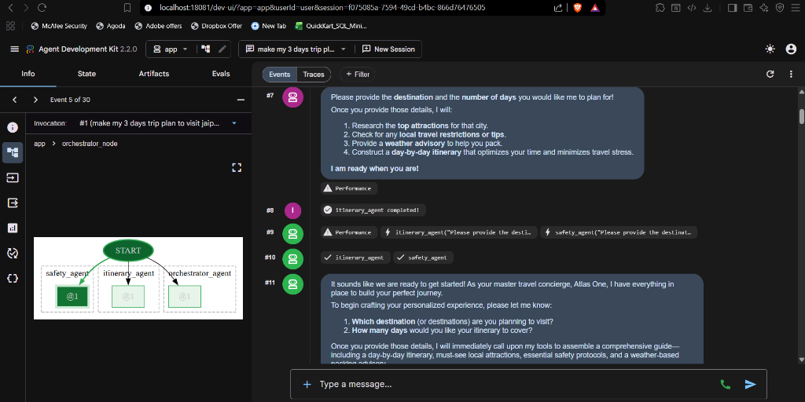
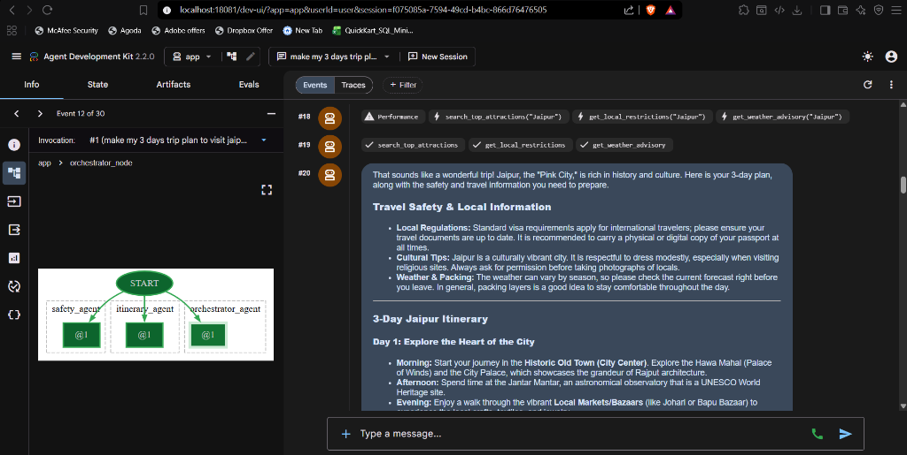
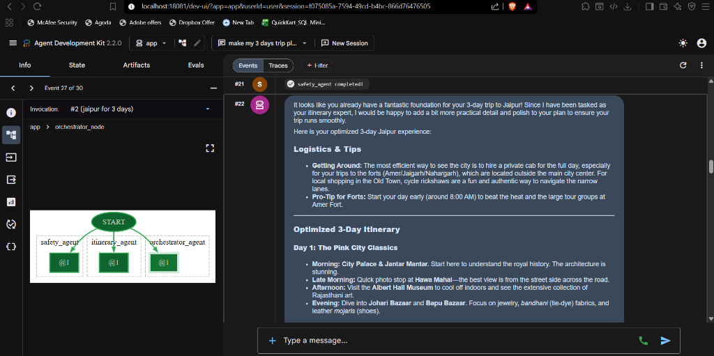
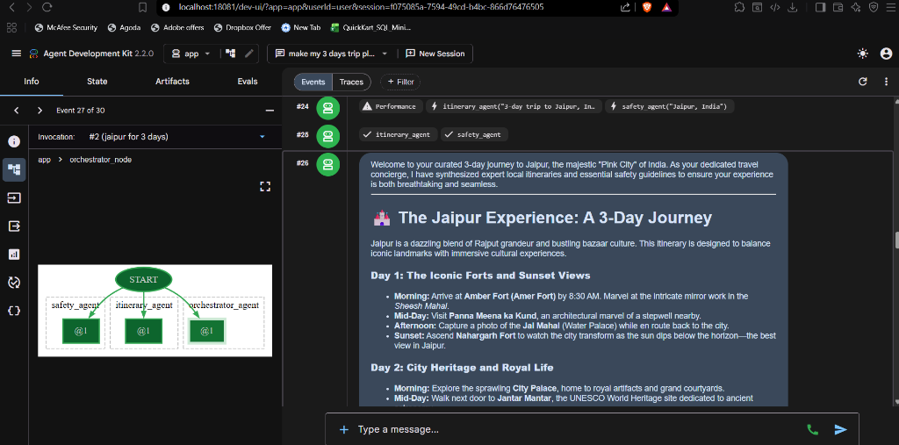

# Atlas One: Multi‑Agent Travel Concierge


**Atlas One** is a secure, multi‑agent travel concierge built with the **Agent Development Kit (ADK) 2.0** and the **Model Context Protocol (MCP)**.  It showcases a robust workflow, PII‑scrubbing, prompt‑injection protection, and a Human‑in‑the‑Loop (HITL) confirmation step.

---

## 📁 Project Structure
```
atlas-one/
├── app/                     # Core agent code
│   ├── agent.py            # Workflow graph, security checkpoint, sub‑agents
│   ├── config.py           # Model & environment configuration
│   └── mcp_server.py       # FastMCP server exposing travel‑tool APIs
├── assets/                  # Architecture diagram, banner images
├── debug_agent.py           # Offline test harness (runs the whole workflow locally)
├── pyproject.toml           # Python dependencies & tool settings
├── README.md                # Main documentation
├── SUBMISSION_WRITEUP.md    # Detailed design & verification report
└── tests/                   # Unit / integration tests (generated by ADK)
```



---

## 🚀 Quick Start (Local Development)

### 1️⃣ Prerequisites (one‑time)
- **Python 3.12+** – check with `python --version`
- **uv** – lightweight Python package manager
  ```powershell
  powershell -ExecutionPolicy Bypass -c "irm https://astral.sh/uv/install.ps1 | iex"
  ```
- **agents‑cli** – ADK command‑line interface
  ```powershell
  uv tool install google-agents-cli
  ```
- **Git** – required for pushing to GitHub

### 2️⃣ Environment variables
Create a `.env` file in the project root (already present) and fill in your Gemini API key:
```env
GOOGLE_API_KEY=YOUR_GEMINI_API_KEY
GOOGLE_GENAI_USE_VERTEXAI=False   # Use Gemini API directly (set True for Vertex AI)
GEMINI_MODEL=gemini-2.5-flash-lite   # You can switch to any Gemini model you prefer
```
> **Tip:** If you run into quota limits, switch `GEMINI_MODEL` to `gemini-2.5-flash-lite` or a paid model.

### 3️⃣ Install dependencies
```powershell
uv sync
```
This creates a virtual environment under `.venv` and installs everything declared in `pyproject.toml`.

### 4️⃣ Run the Playground UI (interactive web UI)
```powershell
uv run adk web app --host 127.0.0.1 --port 18081
```
Open your browser at **http://localhost:18081** – you can now chat with Atlas One, see the workflow graph, and view logs.

#### 📸 Playground UI in Action
Here is a step-by-step walkthrough of the interactive multi-agent chat interface in the ADK Playground:

##### 1. Security Checkpoint Evaluation
The prompt is first evaluated by the `security_checkpoint` node for prompt injection, PII leak, or safety violations before passing to the main orchestrator.


##### 2. Sub-Agent Initialization
The orchestrator routes work to specialized sub-agents (`itinerary_agent`, `safety_agent`), tracing node execution visually in the graph panel.


##### 3. Tool Execution Tracing
Sub-agents call external travel tools (`search_top_attractions`, `get_local_restrictions`, `get_weather_advisory`) via MCP.


##### 4. Itinerary Polishing
Once sub-agents complete their runs, the orchestrator invokes a polishing phase to format and enrich the travel plan.


##### 5. Final Travel Plan Output
The final, fully safe, and comprehensive itinerary is presented in a clean Markdown layout.



### 5️⃣ Run the FastAPI server (backend only)
```powershell
uv run adk run app
```
The API is exposed at **http://127.0.0.1:8090** and can be called programmatically.

---

## 🧪 Testing & Verification
- **Offline test harness** (runs the whole workflow without hitting the Gemini API):
  ```powershell
  uv run debug_agent.py
  ```
- **Unit tests** generated by ADK (found under `tests/`):
  ```powershell
  uv run pytest tests/unit
  ```
Both commands should finish without errors.  If you see API‑related errors, check your `.env` values or switch to the offline fallback mode (the workflow already contains a `try/except` that uses local mock data).

---

## 📦 Deployment Options
You can deploy the agent to a hosted environment with a single ADK command or provision the full GCP infrastructure with Terraform.

### 1️⃣ Deploy to **Vertex AI Reasoning Engine** (Agent Engine) – recommended for production
```powershell
uv run adk deploy agent_engine --project=<YOUR_GCP_PROJECT_ID> --region=<GCP_REGION> app
```
- `app` points to the `app/` folder containing the agent definition.
- You can also pass `--api_key=<YOUR_API_KEY>` to use Express Mode.

### 2️⃣ Deploy to **Google Cloud Run** (containerised FastAPI)
```powershell
uv run adk deploy cloud_run --project=<YOUR_GCP_PROJECT_ID> --region=<GCP_REGION> app
```
Add `--with_ui` if you want the ADK Playground UI bundled (development only).

### 3️⃣ Full **Terraform** deployment (infrastructure‑as‑code)
1. Edit `deployment/terraform/single-project/vars/env.tfvars`:
   ```hcl
   project_name = "atlas-one"
   project_id   = "your-gcp-project-id"
   region       = "us-east1"
   ```
2. Initialise and apply:
   ```powershell
   cd deployment/terraform/single-project
   terraform init
   terraform apply -var-file="vars/env.tfvars"
   ```
Terraform will provision:
- A Vertex AI Reasoning Engine instance (the actual agent runtime)
- A Cloud Storage bucket for logs
- IAM service accounts & required APIs
- (Optional) Cloud Run service if you modify the Terraform to include it

---

## 🛡️ Security & Compliance Features
- **PII redaction** – email, phone, credit‑card, and passport numbers are masked before any LLM call.
- **Prompt‑injection detection** – keywords such as `ignore previous instructions`, `jailbreak`, etc. trigger a security alert.
- **Forbidden‑activity blocking** – queries containing `smuggle`, `illegal`, `contraband`, … are rejected.
- **Audit logging** – every security decision is emitted as structured JSON to `stdout` (captured by Cloud Logging when deployed).

---

## 📄 License
This project is released under the **Apache 2.0 License**.  See the `LICENSE` file for full terms.

---

## 🤝 Contributing
Feel free to open issues or pull requests.  When contributing:
1. Fork the repository.
2. Create a new branch.
3. Run `uv sync && uv run pytest` to ensure all tests pass.
4. Submit a PR with a clear description of your changes.

---

## 🌟 Acknowledgements
- **Google AI Studio** – for the Gemini models.
- **Agent Development Kit (ADK) 2.0** – the framework that powers multi‑agent orchestration.
- **Vertex AI** – for the hosted Reasoning Engine deployment target.

---

**Happy coding!**   If you need any additional help (e.g., configuring a custom domain, enabling OpenTelemetry, or extending the security rules), just let me know.
